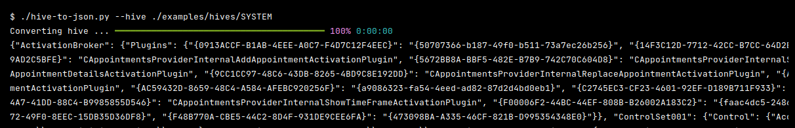

# Hivetools

<p align="center">
   A collection of python scripts to work with Windows Hives.
   <br>
   
   
   <a href="https://twitter.com/intent/follow?screen_name=podalirius_" title="Follow"></a>
  <br>
</p>



## Examples

 + Get a specific key in a hive:

    ```
    ./hive-get-keys.py -H ./examples/hives/SAM -k 'SAM\Domains\Builtin\Aliases\Members\S-1-5-21-877132822-430060850-1589397531\000001F4\(default)'
    ```

 + Exporting a hive to JSON:

    ```
    ./hive-to-json.py --hive ./examples/hives/SYSTEM -o ./examples/json/SYSTEM.json
    ```

## Contributing

Pull requests are welcome. Feel free to open an issue if you want to add other features.

## References
 - http://sentinelchicken.com/data/TheWindowsNTRegistryFileFormat.pdf
 - https://github.com/msuhanov/regf/blob/master/Windows%20registry%20file%20format%20specification.md
